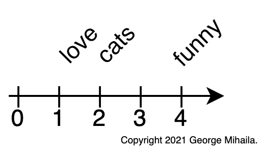

<style>
img[alt~="center"] {
  display: block;
  margin: 0 auto;
}
</style>

# <!-- fit --> Natural Language Processing and Transformers

<br/><br/>

**George Mihaila**

*PhD Candidate Computer Science*
*University of North Texas*

<br/>

---
# About me

- Research Scientist at Amazon.
- PhD Candidate Computer Science at University of North Texas.
- Over 5 years of experience in the field of Deep Learning, Machine Learning and Natural Language Processing (NLP).
- Over 3 years experience in industry as Machine Leaning Engineer, Data Scientist and Research Scientist.
- Technical reviewer for 2 NLP Transformers models books: `Transformers for Natural Language Processing` (`1st` & `2nd` edition).
- In my free time I like traveling, cooking and small projects like writing tutorials on NLP/Deep Learning.

---
# Agenda

* Intro
  * Understanding Natural Language Processing
  * Word embeddings
* The Transformer model
* BERT model
  * Architecture
  * Inner Workings
  * Embeddings
* Sentiment Analysis
* Conclusions
* Q&A

<br>


---

# Intro

## Wikipedia

**Natural language processing (NLP)** is a subfield of linguistics, computer science, and artificial intelligence **concerned with the interactions between computers and human language** ...

... The result is a computer capable of **"understanding"** the contents of documents, including the contextual nuances of the language within them.


---
# Understanding Natural Language Processing

---
# Understanding Natural Language Processing

```python
example = "I love cats! Cats are very funny."
```

---
# Understanding Natural Language Processing

```python
example = "I love cats! Cats are very funny."
```

```python
vocabulary = ['i', 'love', 'cats', 'are', 'funny']
```

---
# Understanding Natural Language Processing

```python
example = "I love cats! Cats are very funny."
```

```python
vocabulary = ['i', 'love', 'cats', 'are', 'funny']
```

```python
word_id = {'i': 0, 'love': 1, 'cats': 2, 'are': 3, 'funny': 4}
```

---
# Understanding Natural Language Processing

```python
example = "I love cats! Cats are very funny."
```

```python
vocabulary = ['i', 'love', 'cats', 'are', 'funny']
```

```python
word_id = {'i': 0, 'love': 1, 'cats': 2, 'are': 3, 'funny': 4}
```

Encode text into numbers.


---


# Word embeddings
---


# Word embeddings

- Use numbers to represent words:
  ```python
  'love' : 1
  'cats' : 2
  'funny': 4
  ```

---


# Word embeddings
- Use numbers to represent words:
  ```python
  'love' : 1
  'cats' : 2
  'funny': 4
  ```

- User vectors instead of numbers

  ```python
  'love' : [0.90, 3.10]
  'cats' : [3.40, 3.20]
  'funny': [0.45, 1.88]
  ```

---


# Word embeddings
- Use numbers to represent words:
  ```python
  'love' : 1
  'cats' : 2
  'funny': 4
  ```

- User vectors instead of numbers
  ```python
  'love' : [0.90, 3.10]
  'cats' : [3.40, 3.20]
  'funny': [0.45, 1.88]
  ```

- **Word embeddings** are a type of word **representation** that allows words with similar meaning to have a similar representation.


---
# The Transformer

* Is a **deep neural network architecture** for **transforming one sequence into another one** with the help of two parts (**Encoder** and **Decoder**).
* Was first introduced by Google in 2017 in the paper [Attention Is All You Need](https://arxiv.org/pdf/1706.03762.pdf).
* Is based solely on attention mechanisms.
* It brought ***"the biggest leap forward in the past five years, and one of the biggest leaps forward in the history of Search."*** for Google.

---
# The Transformer

- Is a **deep neural network architecture** for **transforming one sequence into another one** with the help of two parts (**Encoder** and **Decoder**).
* It can ***transform*** an article to a summary or translate english to another language, etc.


---
# The Transformer

- Is based solely on attention mechanisms.


* **Disclaimer:**
  - I will not cover attention since this is not the intent of this presentation.
  - [The Illustrated Transformer](http://jalammar.github.io/illustrated-transformer/) by [Jay Alammar](http://jalammar.github.io) is great resource!

---
# BERT

## Wikipedia

* Bidirectional Encoder Representations from Transformers (BERT) is a transformer-based machine learning technique for natural language processing (NLP) pre-training developed by Google.
* BERT was created and published in 2018 by Jacob Devlin and his colleagues from Google. 
* In 2019, Google announced that it had begun leveraging BERT in its search engine, and by late 2020 it was using BERT in almost every English-language query. 
* A 2020 literature survey concluded that "in a little over a year, BERT has become a ubiquitous baseline in NLP experiments".


---
# Architecture

- We only have the encoder side of Transformer:


---
# Inner Workings

- [Detailed diagram](https://raw.githubusercontent.com/gmihaila/ml_things/master/notebooks/pytorch/bert_inner_workings/bert_inner_workings.png)


---

# BERT Embeddings

* `"I love cats"` is passed to the BERT model.
* Output word embeddings for each word in the **Word Sequence**.
* Special symbol word at the beginning of any **Word Sequence**.
* `[CLS]` used to represent meaning of the **Word Sequence**.
* Context specific embeddings.


---
# Movie Review Sentiment Analysis

* We will target a particular Natural Language Processing (NLP) problem -  Sentiment Analysis.

* IMDB movie reviews sentiment dataset:
  * This is a dataset for binary sentiment classification containing a set of 25,000 highly popular movie reviews for training, and 25,000 for testing.


---

# Sentiment Analysis with BERT Embeddings

* Took `2,000` random movie reviews from the **IMDB movie reviews sentiment dataset**.
* Compressed each of the `768` embeddings representation in `2` components using **PCA**.
* Plot each movie review:
  `orange` - **positive**
  `blue` - **negative**

---
# Sentiment Analysis with BERT Embeddings


---
# Sentiment Analysis with BERT Embeddings


---
# Sentiment Analysis with BERT Embeddings


`I could not agree less with the rating that was given to this movie, and I believe this is a sample of how short minded 
most of spectators are all over the world. Really... Are you forgetting that Cinema used to be a kind of art before...`

* BERT model had some trouble understanding this review ?!

---
# K-means with BERT embeddings

* Use K-means clustering with BERT embeddings.
* We know we have two sentiments - number of clusters 2.

* 


---


---
# Fine-grained Sentiment Analysis

* Sentiment classifiers are used in binary classification (just positive or just negative sentiment).
* Fine-grained sentiment classification is a significantly more challenging task!
* Typical breakdown of fine-grained sentiment:


---
# K-means with BERT embeddings

* Use K-means clustering with BERT embeddings.
* Try to find 3 sentiments (positive, neutral, negative) - number of clusters 3.
* 


---


---
# K-means with BERT embeddings

* Use K-means clustering with BERT embeddings.
* Try to find 5 sentiments (positive, weakly_positive, neutral, weakly_negative, negative) - number of clusters 5.
* 


---


---
# Try it out yourself

[](https://colab.research.google.com/github/gmihaila/ml_things/blob/master/notebooks/pytorch/bert_inner_workings.ipynb) &nbsp;
[](https://github.com/gmihaila/ml_things/blob/master/notebooks/pytorch/bert_inner_workings.ipynb)


---
# Conclusions

* I showed you:
  * What word embeddings are.
  * What are Transformers and BERT models.
  * How BERT embeddings work.
* We did some sentiment analysis on a movie review dataset and how to find more sentiments.


---
# Check out my Notebooks Tutorials


| Name 	| Description 	| Links 	|
|:- |:- |:- |
| **:grapes: Better Batches with PyTorchText BucketIterator** | *How to use PyTorchText BucketIterator to sort text data for better batching.* |[](https://colab.research.google.com/github/gmihaila/ml_things/blob/master/notebooks/pytorch/pytorchtext_bucketiterator.ipynb) [](https://github.com/gmihaila/ml_things/blob/master/notebooks/pytorch/pytorchtext_bucketiterator.ipynb) [](https://www.dropbox.com/s/7gyq6qup6y43z9b/pytorchtext_bucketiterator.ipynb?dl=1) [](https://gmihaila.medium.com/better-batches-with-pytorchtext-bucketiterator-12804a545e2a) [](https://gmihaila.github.io/tutorial_notebooks/pytorchtext_bucketiterator/) |
| **:dog: Pretrain Transformers Models in PyTorch using Hugging Face Transformers** | *Pretrain 67 transformers models on your custom dataset.* |[](https://colab.research.google.com/github/gmihaila/ml_things/blob/master/notebooks/pytorch/pretrain_transformers_pytorch.ipynb) [](https://github.com/gmihaila/ml_things/blob/master/notebooks/pytorch/pretrain_transformers_pytorch.ipynb) [](https://www.dropbox.com/s/rkq79hwzhqa6x8k/pretrain_transformers_pytorch.ipynb?dl=1) [](https://gmihaila.medium.com/pretrain-transformers-models-in-pytorch-using-transformers-ecaaec00fbaa) [](https://gmihaila.github.io/tutorial_notebooks/pretrain_transformers_pytorch/) |
| **:violin: Fine-tune Transformers in PyTorch using Hugging Face Transformers** | *Complete tutorial on how to fine-tune 73 transformer models for text classification — no code changes necessary!* |[](https://colab.research.google.com/github/gmihaila/ml_things/blob/master/notebooks/pytorch/finetune_transformers_pytorch.ipynb) [](https://github.com/gmihaila/ml_things/blob/master/notebooks/pytorch/finetune_transformers_pytorch.ipynb) [](https://www.dropbox.com/s/tsqicfqgt8v87ae/finetune_transformers_pytorch.ipynb?dl=1) [](https://medium.com/@gmihaila/fine-tune-transformers-in-pytorch-using-transformers-57b40450635) [](https://gmihaila.github.io/tutorial_notebooks/finetune_transformers_pytorch/)|
| **⚙️ Bert Inner Workings in PyTorch using Hugging Face Transformers** | *Complete tutorial on how an input flows through Bert.* |[](https://colab.research.google.com/github/gmihaila/ml_things/blob/master/notebooks/pytorch/bert_inner_workings.ipynb) [](https://github.com/gmihaila/ml_things/blob/master/notebooks/pytorch/bert_inner_workings.ipynb) [](https://www.dropbox.com/s/jeftyo6cebfkma2/bert_inner_workings.ipynb?dl=1) [](https://gmihaila.medium.com/%EF%B8%8F-bert-inner-workings-1c3054cd1591) [](https://gmihaila.github.io/tutorial_notebooks/bert_inner_workings/)|
| **🎱 GPT2 For Text Classification using Hugging Face 🤗 Transformers** | *Complete tutorial on how to use GPT2 for text classification.* |[](https://colab.research.google.com/github/gmihaila/ml_things/blob/master/notebooks/pytorch/gpt2_finetune_classification.ipynb) [](https://github.com/gmihaila/ml_things/blob/master/notebooks/pytorch/gpt2_finetune_classification.ipynb) [](https://www.dropbox.com/s/6t6kvlewoabwxqw/gpt2_finetune_classification.ipynb?dl=1) [](https://gmihaila.medium.com/gpt2-for-text-classification-using-hugging-face-transformers-574555451832) [](https://gmihaila.github.io/tutorial_notebooks/gpt2_finetune_classification/)|

---
# Q&A

Thank you!

---
# Contact 🎣

Let's stay in touch!


🦊 GitHub: [gmihaila](https://github.com/gmihaila)

🌐 Website: [gmihaila.github.io](https://gmihaila.github.io/)

👔 LinkedIn: [mihailageorge](https://www.linkedin.com/in/mihailageorge/)

📓 Medium: [@gmihaila](https://gmihaila.medium.com)

📬 Email: [georgemihaila@my.unt.edu.com](mailto:georgemihaila@my.unt.edu.com?subject=GitHub%20Website)


---
# Resources

- [@gmihaila](https://gmihaila.medium.com)
- [Text Classification](https://monkeylearn.com/text-classification/)
- [What is a transformer](https://medium.com/inside-machine-learning/what-is-a-transformer-d07dd1fbec04)
- [Google's Search Engine biggest leap](https://whatsnewinpublishing.com/google-has-made-one-of-the-biggest-leaps-forward-in-the-history-of-search-what-it-means-for-publishers/)
- [Understand transformers](https://www.analyticsvidhya.com/blog/2019/06/understanding-transformers-nlp-state-of-the-art-models/)
